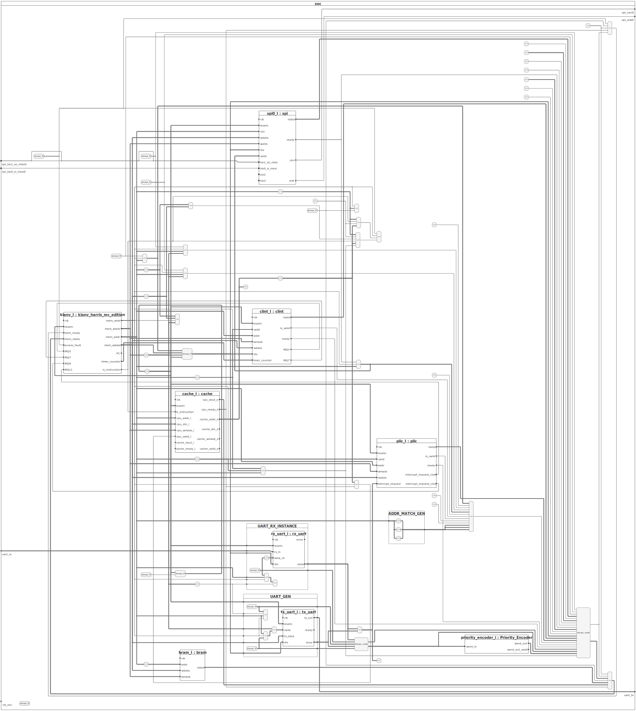

# SoC Architecture

In this project, we are building a System on Chip (SoC) based on the RISC-V architecture. Below, we describe the main components and their interconnections.

## Main Components

1. **Central Processing Unit (CPU)**
   - Based on the RISC-V rv32ima architecture.
   - Supports basic and extended instructions for general-purpose operations.

2. **Memory**
   - **Program Memory (ROM):** Stores the boot code and firmware.
   - **Data Memory (RAM):** Used to store temporary data and variables during program execution.
   - **External SDRAM:** Managed by a dedicated SDRAM controller, used for larger data storage.

3. **Peripheral Controllers**
   - **Interrupt Controller (CLINT and PLIC):** Manages hardware interrupts.
   - **UART Controller:** Provides serial communication.
   - **GPIO Controller:** Manages general-purpose input/output pins.
   - **Audio Controller (PWM):** Generates PWM signals for audio output.
   - **SPI Controller:** Manages SPI communication with external devices like OLED displays and network chips.

4. **Interconnection Bus**
   - **Data Bus:** Connects the CPU with memory and peripherals.
   - **Control Bus:** Transports control signals between the CPU and other components.

## Block Diagram

Below is a simplified block diagram of the SoC architecture:



and the dependecies between modules:


## Functional Description

1. **Initialization:** Upon powering up the SoC, the CPU executes the boot code stored in the ROM.
2. **Program Execution:** The CPU loads instructions from the RAM and executes them.
3. **Interrupt Management:** Hardware interrupts are managed by the interrupt controllers (CLINT and PLIC), which notify the CPU to take necessary actions.
4. **Serial Communication:** The UART controller allows communication with other devices via a serial interface.
5. **GPIO Interaction:** The GPIO pins enable interaction with external devices such as sensors and actuators.
6. **Audio Output:** The PWM controller generates audio signals from PCM samples.
7. **SPI Communication:** The SPI controllers manage communication with external devices like OLED displays and network chips.

## Additional Features

- **Reset and Boot Mechanism:** The module handles system reset and boot logic. An internal reset signal is released after a certain number of cycles once the PLL has locked the clock.
- **Access Fault Handling:** Detects invalid access attempts to unsupported addresses and triggers an "access fault" signal.
- **CPU Frequency and Memory Size:** Special registers provide the CPU frequency and the size of main memory.

This modular design allows for easy expansion and customization of the SoC for different applications.

## Supported PMODs

The SoC supports various PMODs, including:
- GPIO (input, output)
- Network PMOD (Digilent PMOD NIC100)
- Second UART (PMOD UART by Digilent)
- OLED display (Digilent OLEDrgb 64x96, 16-bit)

The board can function without these PMODs, with the kernel adjusting accordingly. Additionally, the SoC supports X11 with a larger 320x240 display, requiring 64 MiB of SDRAM.

## Network Chip Support

We support the following network chips: ENC28J60 (default), ENC24J600, W5500. These can be connected via CS, SCLK, MOSI, MISO, and interrupt pins.

## Generating Gateware

The project supports a structured directory for FPGA boards. Use the provided Makefiles in specific folders for board-specific builds.

## Building Operating Systems

### Linux Build Instructions

```
cd os/linux/buildroot-kianv-soc
# make NETWORK_CHIP=[enc28j60 (default), encx24j600, w5500]
make -j $(nproc) # build full operating system
make flash_os DEVICE=/dev/sdx # flash full operating system
#make flash_rootfs DEVICE=/dev/sdx # flash only rootfs
#make flash_kernel DEVICE=/dev/sdx # flash kernel
```

### XV6 Build Instructions

```
cd os/xv6/
./build.sh /dev/sdx
```

## Resources

- https://github.com/smunaut/iCE40linux
- https://github.com/splinedrive/iCE40linux
- https://www.five-embeddev.com/riscv-isa-manual/latest/machine.html
- https://courses.cs.duke.edu/fall22/compsci510/schedule.html
- https://github.com/jameslzhu/riscv-card
- https://danielmangum.com/posts/risc-v-bytes-qemu-gdb/
- https://www.qemu.org/docs/master/system/target-riscv.html
- https://riscv.org/technical/specifications/
- https://starfivetech.com/uploads/sifive-interrupt-cookbook-v1p2.pdf
- https://github.com/ultraembedded/exactstep
- https://github.com/qemu
- https://github.com/pulp-platform/clint
- https://gitlab.com/x653/xv6-riscv-fpga
- https://github.com/regymm/quasiSoC
- https://pdos.csail.mit.edu/6.S081/2020/xv6/book-riscv-rev1.pdf
- https://github.com/cnlohr/mini-rv32ima

and many more!

